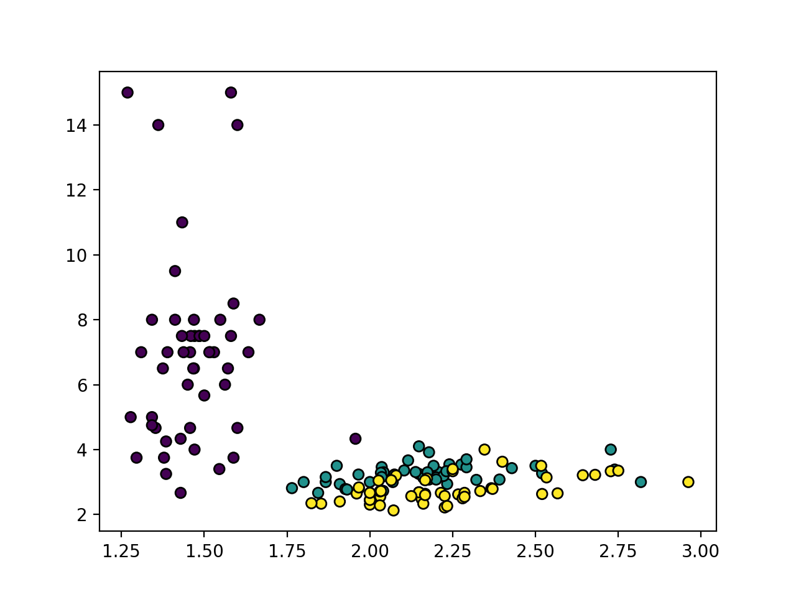
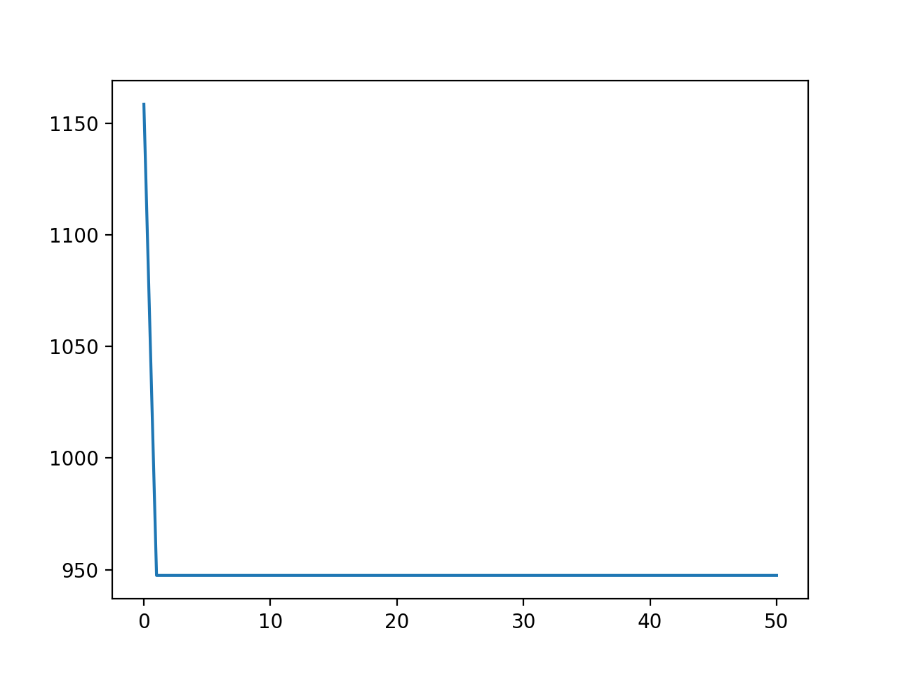
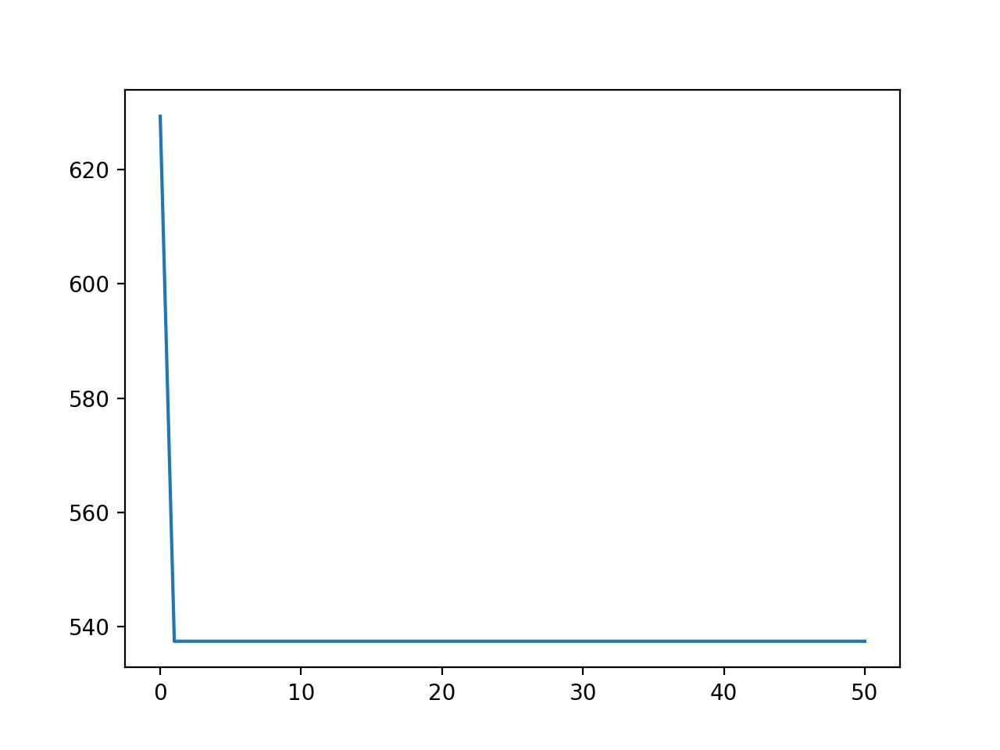
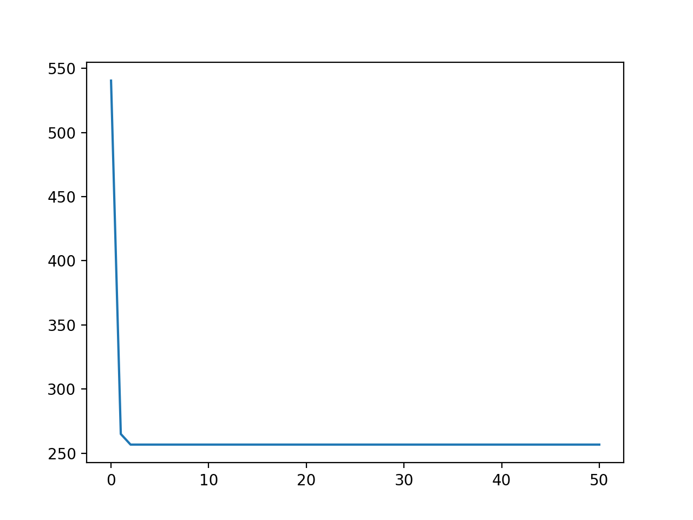
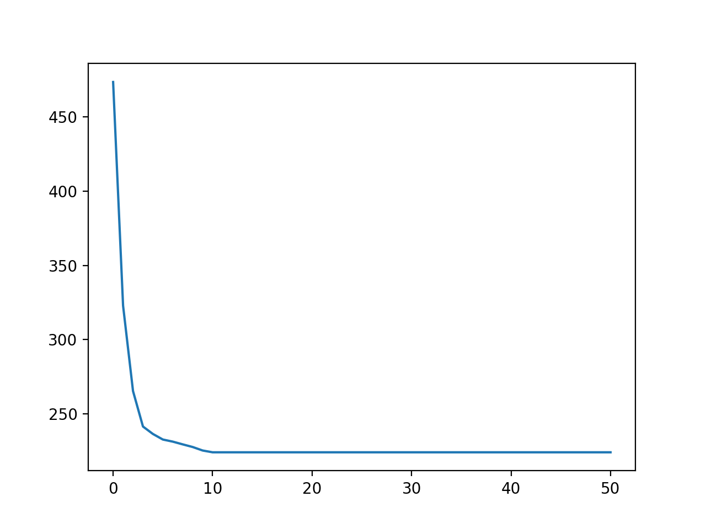
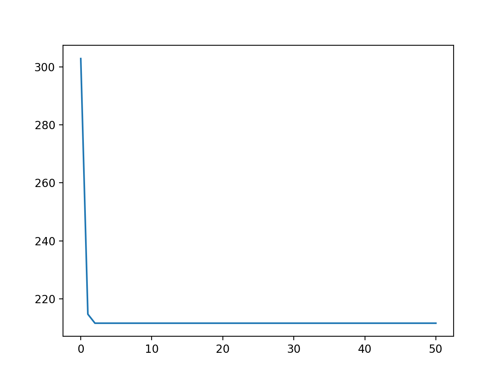
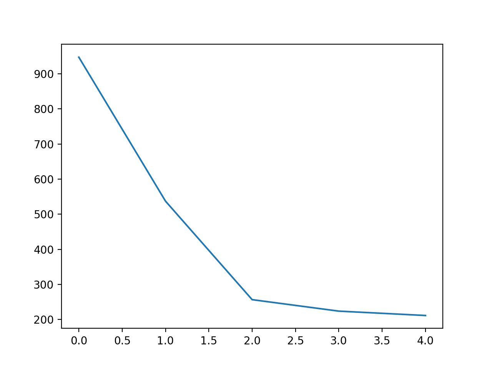
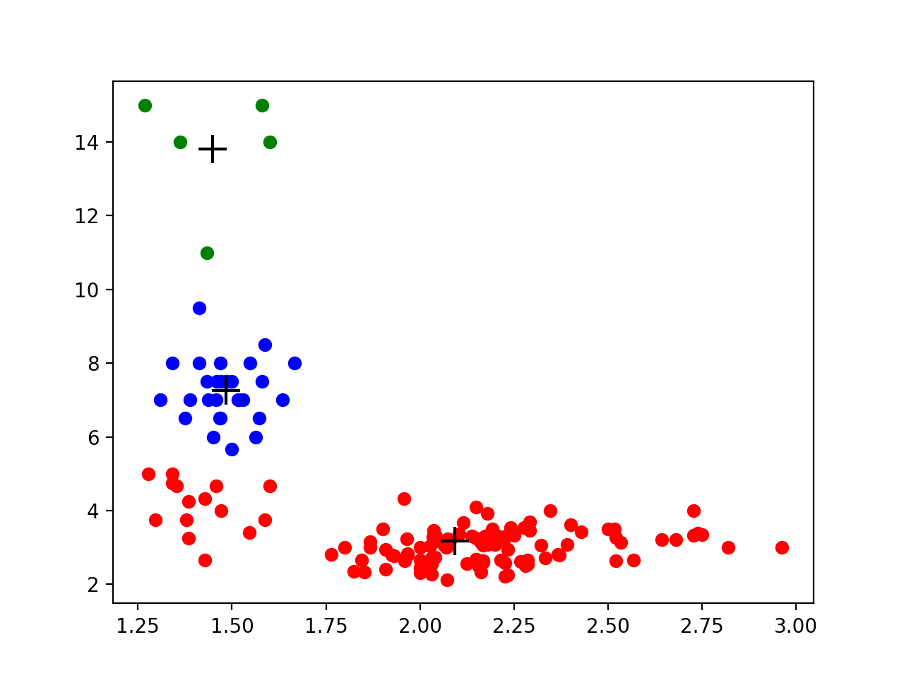

# *k*-means clustering

Here we will implement the *k*-means++ algorithm in Python. We will then use it to cluster Iris dataset from the UCI Machine Learning Repository. The data is contained the ```iris.data``` file under "Data Folder", while the file ```iris.names``` contains a description of the data. The features **x** are given as the first four comma-separated values in each row in the data file. The labels *y* are the last entry in each row, but we do NOT need the class label as it is unknown for clustering.
1. ```sepal length``` (cm)
2. ```sepal width``` (cm)
3. ```petal length``` (cm)
4. ```petal width``` (cm)
5. ```class```: {Iris Setosa, Iris Versicolour, Iris Virginica}

- Create a new data set with two features by computing the ratio of raw features (**x** = (x<sub>1</sub>, x<sub>2</sub>) where *x<sub>1</sub>* = (```sepal length```/```sepal width```) and *x<sub>2</sub>* = (```petal length```/```petal width```)) and plot the data to observe the clusters in data (use class label to color the data points for better illustration of clusters).
- Implement the *k*-means++ algorithm.
- Cluster the modified Iris dataset with with two features explained above. Run the algorithm 50 times over the data with different values of clusters *k* = 1,2,...,5 and plot the accuracies (*x* and *y* axes should be the number of clusters and the clustering objective, respectively).
- Based on the above plot, decide the number of final clusters and justify your answer. For the chosen number of clusters,
  1. Create a plot showing how objective changes with number of iterations.
  2. Create a plot with the data colored by assignment, and the cluster centers.

## Results

#### Plot of x1, x2 (iris data set)


#### Plot of objective function vs number of iterations
<p float="left">
  
   
</p>
<p float="left">
  
   
</p>
<p float="left">
  
</p>

#### Plot of accuracies
_x-axis_ is the number of clusters (it says 0,1,2,3,4 because I named them that way, but actually those are 5 (1,2,3,4,5) clusters represented by 0,1,2,3,4. _y_ is the clustering objective



#### Plot of data
Colored with assignments and the cluster centers (the centers are represented by the ‘+’ symbol)


